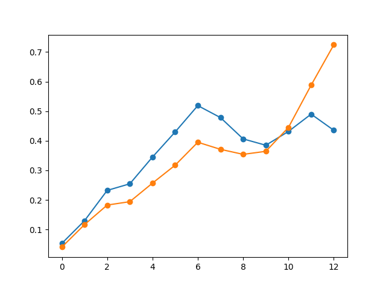
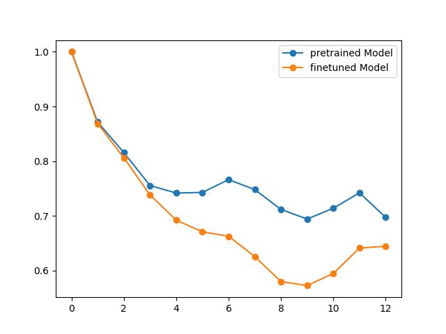
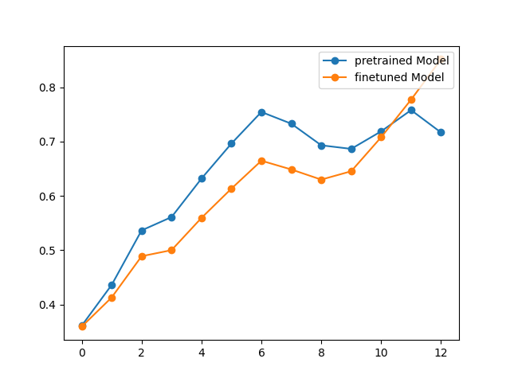
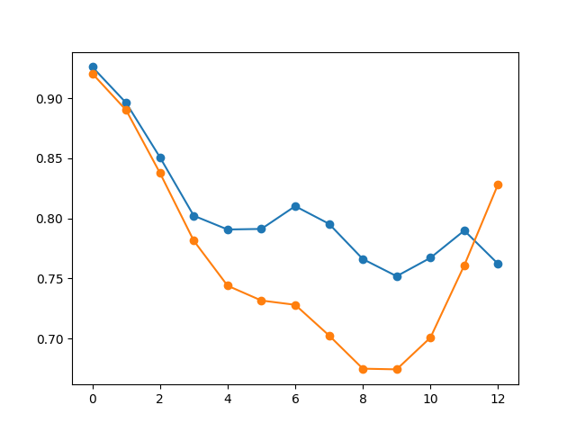
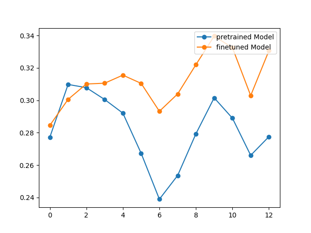
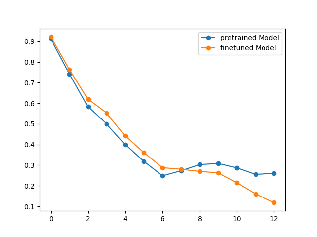

# BERT-analysis
This is the homework 3-1 part repository of Deep Learning for Human Language Processing 
## Goal
The goal for this homework is:
* train a chinese nli task and save model.
* generate dataset which created from each layer embedding of each data in xnli sample data (two dataset: one is created from pretrained model, the other one is fintuned model.)
* analysis embeddings (anisotropy, self-similarity, Maximum Explainable Variances) (also include the adjusted anisotropy version)

## Dataset: Xnli zh
Training:  https://www.nyu.edu/projects/bowman/xnli/XNLI-MT-1.0.zip  

(Use XNLI-MT-1.0/multinli/multinli.train.zh.tsv)

Testing:  https://www.nyu.edu/projects/bowman/xnli/XNLI-1.0.zip 

(Use XNLI-1.0/xnli.dev.tsv)

replace the same name folder in the dataset folder and put the corresponding data  into the dataset folder

Analysis Data: https://drive.google.com/open?id=1B-J6iuSj4OX_o3igmofUBPpY8lG9IVIT 

(xnli.examples.tsv)

## Step 1 Train xnli and achieve accuracy performance approximately 73-76%
Hint: Utilize `run_xnli.py`

* Train a model on multinli.train.zh.tsv and test on xnli.dev.tsv
* Plot the training loss and testing accuracy 
* 3 epochs may be sufficient
* Remember to save the best model for later analysis

## Step 2 Generate pretrained data and finetune data from xnli-sample data
Example Code: `generate-similarity-data.py` (Using analysis data )(You also can write by yourself)

Write a code named `generate-similarity-data.py`

store each xnli data with its 

{"input_ids": ..., "layer_0": the embedding of each data in numpy array in layer_0, "layer_1": the embedding of each data in numpy array in layer_1, "layer_2": the embedding of each data in numpy array in layer_2, ... "layer_12":the embedding of each data in numpy array in layer_12}

(data is a list of dict)

Hint: you need to save the data generate from pretrained model and fintuned-model (the model you save)

## Step 3 analysis bert layer embedding:

There are four main definitions in this part:

Preprocessing data: 

for the following four definitions, the embedding you need to remove [CLS] and [PAD] and [SEP] three kinds of word to analysis the trend of embeddings of each layer

**Four main definition**:

  **Anistropy**:  
  
  The expected cosine similarity between 2 random word embeddings of a layer
  
  **Self-similarity**:  
 
  The average cosine similarity of every embedding of a word (character for chinese) in a given layer
  
  **Intra-sentence similarity**: 
  
  The average cosine similarity between the sentence’s embedding. (mean pooling the words from a sentence data to form sentence embedding and calculate the cosine similarity with each words inside the sentence and the sentence embedding)
  
  **Maximum explainable variance**: 
  
  In a given layer, take all embeddings of a word, stack them into a matrix and using SVD to compute their singular values The MEV is (the first (biggest) singular value’s square) / (sum of squares of all the singular values)
  
  **Two modifying definitions**:
  
  **Anisotropy adjusted self-similarity**
  
  A word’s self-similarity - Anisotropy
  
  **Anisotropy adjusted intra-sentence similarity**:
  
  Intra-sentence similarity - Anisotropy

 
Code:
  
  Write a code named `similarity.py`
  
  **Preprocessing data**: 
  
  For the following four definitions, the embedding you need to remove [CLS] and [PAD] and [SEP] three kinds of word to analysis the trend of embeddings of each layer (corresponding word index are 101, 0, 102)
  
  The code may needs four functions:
  
  * **Anisotropy_function(... ,layer_index)** : 
  
  return Anistropy of each layer 
  
  * **SelfSimilarity_function(... , layer_index)**: 
  
  return self similarity of each layer 
  
  * **IntraSentenceSimilarity_function(... , layer_index)**: 
  
  retrun intra sentence similarity of each layer 
  
  * **MaximumExplainableVariance_function(... , layer_index)**: 
  
  return maximum explainable variance of each layer 
  
  **Plot the corresponding figure of each definition for both pretrained embeddings and finetuned embeddings and save in bert/picture**
  
  Anisotropy of each layers:

  
  
  Self similarity of each layers:

  
  
  Intra similarity of each layers:

  
  
  Maximum explainable variance of each layers:

  

  Anisotropy adjusted intra-sentence similarity of each layers:

  

  Anisotropy adjusted self-similarity of each layers:

  

  Blue line is pretrained model, x-axis is layer index and  y-axis is the value of corresponding value.
  
  
  
  
  
  
  

  

